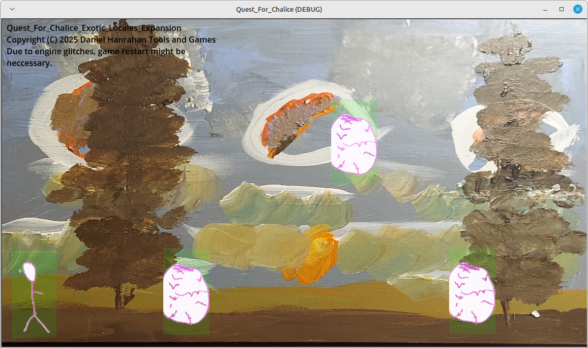
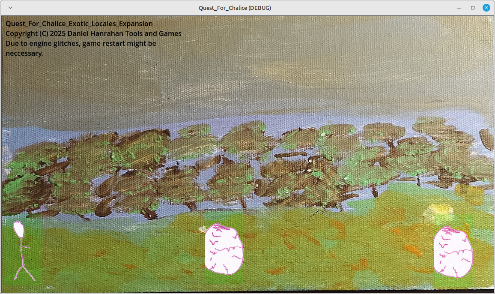
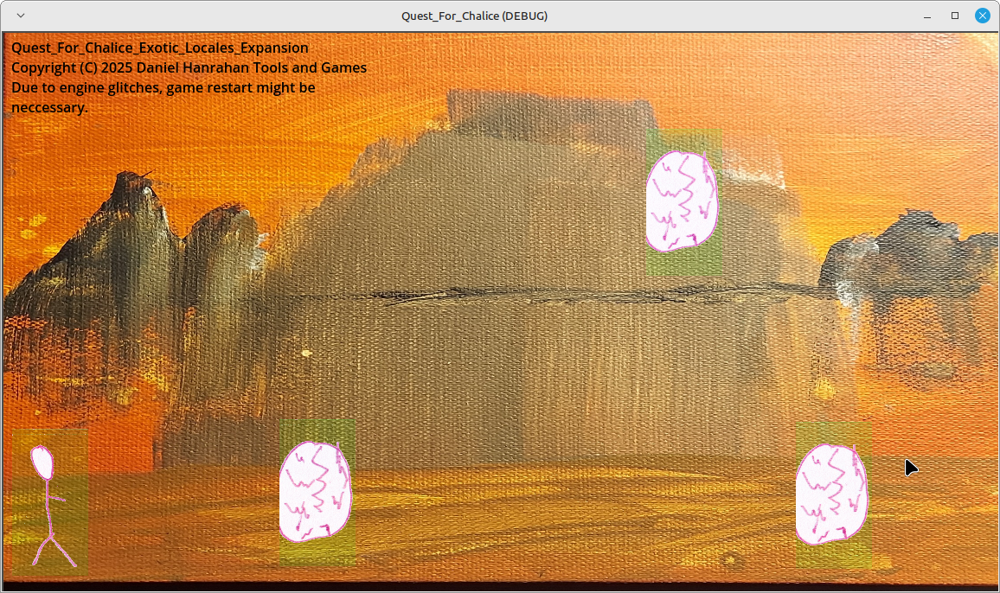

<!DOCTYPE html>
<html>
<head>
</head>
<body>
<h1>Exotic locales expansion</h1>
<h2>This page is under the GNU GPL v3.0 and everything on this page that the GNU GPL v3.0 does not cover is under this license: This work is licensed under Attribution-ShareAlike 4.0 International.</h2>
<h3>The expansion shown here is now open source under the GNU GPL 3.0 as of April/4-1st-2026 and no this not a joke in any way shape or form.</h3>

Link to main page and repository

<ul>
    <li><a href="https://daniel-hanrahan-tools-and-games.github.io/Quest_For_Chalice/">Main Game Read Me Page</a></li>
    <li><a href="https://github.com/Daniel-Hanrahan-Tools-and-Games/Quest_For_Chalice">Main Game Repository Page</a></li>
    <li><a href="https://github.com/Daniel-Hanrahan-Tools-and-Games/Quest_For_Chalice_Exotic_Locations_Expansion/edit/main/README.md">Repository Page</a></li>
</ul>

Not available for compacted version or GCSE version and I hope someone makes a compacted or GCSE version of this expansion.

Why make this expansion open source the reason for that is I want to make sure this expansion is accessible to everyone and no one made an attempt to try to buy the expansion whatsoever, I did not see an email from anyone who wanted to buy it.

CC BY-SA 4.0 and GNU GPL v3.0 Conditional Exceptions to use MPL 2.0 and CC BY-SA 4.0 or CC BY 4.0

If the following condition is met, the licensing rules for both content covered by GNU GPL v3.0 and content not covered by GNU GPL v3.0 are modified as described below:

Condition:

The developer is distributing, porting, or integrating the software with platforms or environments that impose requirements incompatible with GPL-3.0, including but not limited to:
- proprietary or non-redistributable SDKs
- confidential hardware or platform documentation
- legally required confidentiality obligations preventing full GPL redistribution
- safety-regulated or certified systems where full GPL redistribution cannot be satisfied

Effect on licensing:

- Content covered by GNU GPL v3.0: May instead be used under the Mozilla Public License 2.0.

- Content not covered by GNU GPL v3.0 (e.g., assets): Normally may be used under CC BY-SA 4.0. If ShareAlike requirements of CC BY-SA 4.0 prevent lawful distribution under the MPL alternative, developers may instead use CC BY 4.0 **solely to the extent necessary** to enable such distribution.

These exceptions apply **only when the condition above is met**.

</body>
<footer>

Copyright (C) 2025 Daniel Hanrahan Tools and Games

</footer>
</html>
